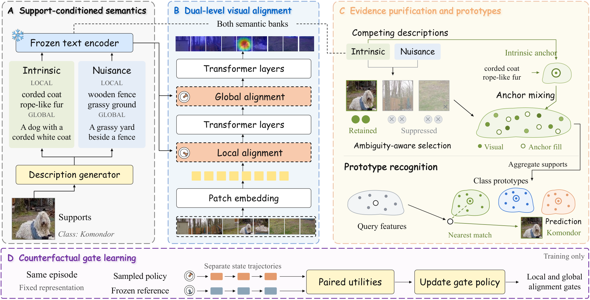

<a id="top"></a>
<div align="center">
  <h1 align="center">DVLA-RL++: Dual-Level Vision-Language Alignment with Reinforcement Learning Gating for Few-Shot Learning</h1>
  Wenhao&#160;Li<sup>1, 2</sup>,
  Xianjing&#160;Meng<sup>3</sup>,
  Qiangchang&#160;Wang<sup>1</sup>,
  Zhongyi&#160;Han<sup>1</sup>,
  Yilong&#160;Yin<sup>1</sup>,
  Liqiang&#160;Nie<sup>4</sup>
  <br />
  <sup>1</sup>School of Software, Shandong University &#160;&#160;
  <sup>2</sup>Shenzhen Loop Area Institute &#160;&#160;
  <sup>3</sup>Shandong University of Finance and Economics &#160;&#160;
  <sup>4</sup>Harbin Institute of Technology (Shenzhen)
  <br/>
  <p>
  <a href="https://arxiv.org/abs/2610.12095"></a>
  
  <a href="https://peacelwh.github.io/TPAMI27-DVLA-RLpp/"></a>
  <a href="https://openreview.net/forum?id=2ix1K6zPRf"></a>
  <a href="https://pytorch.org/get-started/locally/"></a>
  
  <a href="LICENSE"></a>
  <a href="https://peacelwh.github.io/"></a>
  </p>
</div>

This repository is the official PyTorch implementation of **DVLA-RL++**, the journal extension of our ICLR 2026 paper
[DVLA-RL: Dual-Level Vision-Language Alignment with Reinforcement Learning Gating for Few-Shot Learning](https://openreview.net/forum?id=2ix1K6zPRf).
The manuscript is under review at *IEEE Transactions on Pattern Analysis and Machine Intelligence*.
**Project page:** https://peacelwh.github.io/TPAMI27-DVLA-RLpp/

DVLA-RL++ keeps the dual-level semantic alignment of DVLA-RL and adds two components that decide **which support
evidence enters a class prototype** and **how strongly semantics influence each visual layer**:

* **Complementary semantic purification (CSP).** Intrinsic and nuisance descriptions are generated from labeled
  supports only and compared in a shared embedding space. An ambiguity-dependent rejection margin and a sparse
  allocation rule select supported visual tokens, and the rejected mass is assigned to an intrinsic semantic anchor.
* **Counterfactual reinforcement-learning gating (CFG).** A stochastic scalar fusion policy is trained against an
  independently executed reference trajectory on the same episode with a reward that combines classification utility
  and nuisance exposure (CF-PPO). At inference only the deterministic mean policy is executed.

<p align="center"></p>

## Results

5-way accuracy (%) with 95% confidence intervals over 2,000 novel-class episodes (Visformer-Tiny, 224x224 inputs).

### Standard few-shot classification
| Method | miniImageNet 1-shot | miniImageNet 5-shot | tieredImageNet 1-shot | tieredImageNet 5-shot | CIFAR-FS 1-shot | CIFAR-FS 5-shot |
|:--|:--:|:--:|:--:|:--:|:--:|:--:|
| DVLA-RL (ICLR 2026) | 81.69 ± 0.36 | 88.25 ± 0.28 | 83.02 ± 0.43 | 91.71 ± 0.29 | 87.18 ± 0.40 | 90.59 ± 0.31 |
| **DVLA-RL++** | **83.41 ± 0.34** | **89.63 ± 0.26** | **84.57 ± 0.41** | **92.89 ± 0.27** | **88.70 ± 0.38** | **91.75 ± 0.29** |

### Fine-grained few-shot classification
| Method | CUB 1-shot | CUB 5-shot | Stanford Cars 1-shot | Stanford Cars 5-shot | Stanford Dogs 1-shot | Stanford Dogs 5-shot |
|:--|:--:|:--:|:--:|:--:|:--:|:--:|
| DVLA-RL (ICLR 2026) | 91.93 ± 0.28 | 95.06 ± 0.19 | 92.95 ± 0.24 | 96.59 ± 0.15 | 89.64 ± 0.30 | 91.42 ± 0.25 |
| **DVLA-RL++** | **94.31 ± 0.26** | **96.28 ± 0.17** | **95.13 ± 0.22** | **97.14 ± 0.14** | **92.05 ± 0.28** | **92.67 ± 0.23** |

### Cross-domain few-shot classification (trained on miniImageNet)
| Method | CUB 1-shot | CUB 5-shot | Places 1-shot | Places 5-shot | ChestX 1-shot | ChestX 5-shot |
|:--|:--:|:--:|:--:|:--:|:--:|:--:|
| DVLA-RL (ICLR 2026) | 67.46 ± 0.47 | 78.99 ± 0.35 | 69.26 ± 0.45 | 80.70 ± 0.36 | 23.47 ± 0.20 | 26.94 ± 0.22 |
| **DVLA-RL++** | **69.14 ± 0.45** | **80.30 ± 0.33** | **70.87 ± 0.43** | **81.92 ± 0.34** | **23.65 ± 0.19** | **27.10 ± 0.21** |

Full comparison tables, ablations and the diagnostic figures of the paper are collected in [`results/`](results/README.md).

## Repository structure

```
.
├── README.md
├── data/                      # datasets, semantic banks, checkpoints and prompts (not tracked, see data/README.md)
│   ├── datasets/<name>/{base,val,novel}/<class>/*.jpg
│   ├── semantic/<name>_banks.pth
│   ├── checkpoint/visformer-<name>.pth
│   └── prompts/intrinsic_nuisance_prompt.txt
├── src/dvla_rlpp/             # core code
│   ├── config.py              # hyper-parameters (paper defaults)
│   ├── data/                  # episode sampler, datasets, semantic bank store
│   ├── models/
│   │   ├── visformer.py       # Visformer-Tiny backbone with stage-wise access
│   │   ├── gated_attention.py # RL-gated attention block (Sec. 3.2)
│   │   ├── purification.py    # complementary semantic purification (Sec. 3.3)
│   │   ├── policy.py          # Beta gate policy, value baseline, reference gate, CF-PPO (Sec. 3.4)
│   │   └── dvla_rlpp.py       # episode-level model
│   └── engine/                # alternating trainer, evaluator
├── scripts/                   # pretrain / generate_semantics / train / test / ablation pipelines
├── results/                   # figures, tables and logs
└── tests/                     # CPU unit and end-to-end tests (pytest)
```

## Usage

### Requirements
Python >= 3.8 and PyTorch >= 1.13.

```bash
pip install -r requirements.txt
pip install -e .            # optional, installs the dvla_rlpp package
```

Semantic generation additionally needs `transformers>=4.49`, `accelerate`, `qwen-vl-utils` and
[OpenAI CLIP](https://github.com/openai/CLIP); see the comments in `requirements.txt`.

### Datasets
Download the few-shot splits (the same splits as DVLA-RL and [VT-FSL](https://github.com/iLearn-Lab/NeurIPS25-VTFSL))
from [Hugging Face](https://huggingface.co/datasets/iLearn-Lab/NeurIPS25-VTFS) or
[Google Drive](https://drive.google.com/drive/folders/1xmXqS5AZAJpifyg2uyTnTXgWXeK9HthG?usp=drive_link) and extract
them into `data/datasets/`:

```bash
cd data/datasets
tar -xvzf miniImageNet.tar.gz        # -> data/datasets/miniImageNet/{base,val,novel}
```

Supported names: `miniImageNet`, `tieredImageNet`, `CIFAR-FS`, `FC100`, `FG-CUB`, `FG-Cars`, `FG-Dogs`,
`CD-CUB`, `Places`, `ChestX`. See [`data/README.md`](data/README.md) for the layout.

### Semantic banks
Intrinsic and nuisance phrases are generated from labeled supports with Qwen2.5-VL and encoded with the frozen
CLIP ViT-B/16 text encoder (`data/semantic/<dataset>_banks.pth`):

```bash
python scripts/generate_semantics.py --dataset miniImageNet --splits base,val,novel --gpu 0
```

The prompt lives in `data/prompts/intrinsic_nuisance_prompt.txt`; raw phrases are dumped to
`results/semantic/<dataset>_phrases.json` for inspection. Pre-computed banks will be released together with the
checkpoints. The legacy DVLA-RL caches (`<dataset>_semantic_clip_cot.pth` and `<dataset>_attributes_clip.pth`)
are also accepted and are treated as intrinsic banks with empty nuisance banks.

### Pre-trained backbone
Meta-tuning starts from a Visformer-Tiny pre-trained on the base split. Either download
`visformer-<dataset>.pth` (same files as DVLA-RL / VT-FSL) into `data/checkpoint/`, or pre-train it yourself:

```bash
python scripts/pretrain.py --dataset miniImageNet --epoch 800 --batch_size 512 --lr 5e-4 --gpu 0
cp results/pretrain/miniImageNet/visformer-t/best-1shot.pth data/checkpoint/visformer-miniImageNet.pth
```

Use `--epoch 300` for tieredImageNet. If a DVLA-RL checkpoint is placed at
`data/checkpoint/dvla_rl-<dataset>-<shot>shot.pth`, its gate is loaded as the frozen reference policy.

### Training
```bash
python scripts/train.py --dataset miniImageNet --way 5 --shot 1 --epoch 100 --gpu 0
python scripts/train.py --dataset miniImageNet --way 5 --shot 5 --epoch 100 --gpu 0
```

Training alternates representation learning and policy learning after `--warmup_epochs` epochs under the frozen
reference gate (Appendix S5). Paper defaults are `--tau_s 0.2 --lam 0.7 --gamma 0.5 --eta 0.1 --kappa_g 10
--max_local 8 --tau_c 0.2`. Checkpoints and logs are written to `results/save/<dataset>/<name>_<shot>shot/`.

### Testing
```bash
python scripts/test.py --dataset miniImageNet --way 5 --shot 5 --episode 2000 --gpu 0
python scripts/test.py --dataset miniImageNet --test_dataset Places --shot 1 --gpu 0     # cross-domain
python scripts/collect_results.py                                                       # -> results/tables/collected.md
```

The evaluation reports mean accuracy with its 95% confidence interval together with the purification diagnostics
of the paper (token retention, neutral mass, candidate deficit, nuisance cost and mean gate actions).

### Ablations
`scripts/run_ablation.sh` reproduces the component controls (Table 4) and internal controls (Table 5), e.g.

```bash
python scripts/train.py --dataset miniImageNet --shot 1 --name csp_only --no_cfg        # purification only
python scripts/train.py --dataset miniImageNet --shot 1 --name cfg_only --no_csp        # counterfactual gating only
python scripts/train.py --dataset miniImageNet --shot 1 --name static --gate static     # static gate
python scripts/train.py --dataset miniImageNet --shot 1 --name pos_only --positive_only # no nuisance bank
```

### Tests
```bash
pytest tests -q
```

The tests run on CPU within a minute. They verify the KKT properties of the allocation rule, the policy and
CF-PPO surrogate, the parameter boundaries of the alternating schedule, and run the training and testing scripts
end-to-end on a synthetic dataset.

### Full pipelines
```bash
bash scripts/run_miniimagenet.sh     # pre-train, generate semantics, meta-tune and test on miniImageNet
bash scripts/run_all.sh              # all in-domain benchmarks plus the cross-domain transfers
```

## Pre-trained models
Checkpoints and pre-computed semantic banks for every benchmark will be released after the review process.

## Citation
If you find this repository useful, please cite the conference and journal versions:

```bibtex
@inproceedings{li2026dvlarl,
  title     = {{DVLA-RL}: Dual-Level Vision-Language Alignment with Reinforcement Learning Gating for Few-Shot Learning},
  author    = {Li, Wenhao and Meng, Xianjing and Wang, Qiangchang and Han, Zhongyi and Wu, Zhibin and Yin, Yilong},
  booktitle = {International Conference on Learning Representations (ICLR)},
  year      = {2026}
}

@article{li2026dvlarlpp,
  title   = {{DVLA-RL++}: Dual-Level Vision-Language Alignment with Reinforcement Learning Gating for Few-Shot Learning},
  author  = {Li, Wenhao and Meng, Xianjing and Wang, Qiangchang and Han, Zhongyi and Yin, Yilong and Nie, Liqiang},
  journal = {arXiv preprint arXiv:2610.12095},
  year    = {2026}
}
```

## Acknowledgements
The Visformer backbone, episode sampler and pre-training recipe follow [VT-FSL](https://github.com/iLearn-Lab/NeurIPS25-VTFSL)
and [SemFew](https://github.com/zhangdoudou123/SemFew). We thank the authors for releasing their code.
